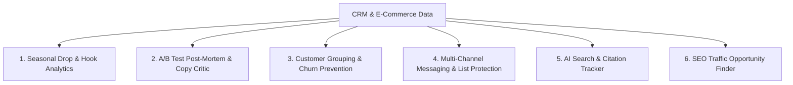

# ⚡ Growth Intelligence Engine
### AI-Powered Growth Marketing & CRM Automation Platform

[](https://growth-intelligence-engine.streamlit.app)
[](https://www.python.org/)
[](https://opensource.org/licenses/MIT)

> **Live Web Application:** [https://growth-intelligence-engine.streamlit.app](https://growth-intelligence-engine.streamlit.app)  
> **What This Is:** A practical growth tool built to bridge the gap between Tableau dashboards and day-to-day CRM campaigns. It analyzes seasonal sales drops, identifies winning copy hooks, groups customers to prevent churn, and optimizes multi-channel campaigns.

---

## 🎯 The Real Problem in D2C & Subscription Growth

Growth and CRM teams face three common headaches every week:
1. **Too Much Data, Not Enough Insight:** Teams spend hours pulling numbers from Tableau and Shopify to see *what* happened, but don't have time to understand *why* it happened.
2. **The "Discount Trap":** Blasting 50% discounts gives short-term sales spikes, but brings in bargain hunters who cancel after month 1.
3. **Lost Learnings:** A/B tests are run on email and SMS, but the learnings get lost, so teams keep making the same copy mistakes.

This platform solves these problems through 6 practical case studies.

---

# 📚 Case Studies Overview



---

### 📂 Case 1: Analyzing Seasonal Drops & Finding Winning Hooks
* **The Challenge:** Big seasonal launches (Valentine's Day, Summer Drops, Black Friday) make up most of annual revenue. Teams need to know whether revenue came from the season itself or from the messaging hook.
* **The Solution:** Automated analysis that compares year-over-year performance, tracks customer retention curves, and measures which copy words drive higher orders.
* **Key Findings:**
  - Standard discounts lowered Average Order Value (AOV) to $68.50.
  - Using a "VIP Vault / Exclusive Access" hook increased AOV to **$84.20 (+22.9%)** and boosted VIP sign-ups by **+90.4%**.
  - **6-Month Loyalty:** Members who joined through exclusive access stayed active **2.6x longer (59.2% vs. 22.8%)** compared to discount shoppers.

---

### 📂 Case 2: A/B Test Post-Mortem & Copywriting Critic
* **The Challenge:** Teams run lots of email/SMS tests, but standard dashboards don't explain *why* one subject line won and another failed.
* **The Solution:** Uses statistical checks (Z-score, $p < 0.001$) to confirm real winners and breaks down copy using proven copywriting frameworks (**PAS: Problem, Agitate, Solve**).
* **Key Impact:**
  - Caught spam-trigger words in losing emails (*"Flash Sale"*, *"40% Off"*).
  - Rewritten emails using curiosity and VIP perks delivered a **+93.2% boost in click rates**.

---

### 📂 Case 3: Customer Lifecycle Grouping (RFM) & Churn Prevention
* **The Challenge:** Simple list filters miss high-spending VIPs who are quietly losing interest before they cancel.
* **The Solution:** Automatically groups 3,000+ customer records based on **how recently they bought, how often they buy, and how much they spend (RFM)**.
* **Automation:** Generates ready-to-use data payloads for CRMs (**Twenty CRM / Klaviyo**) to trigger automatic win-back emails before at-risk VIPs cancel.

---

### 📂 Case 4: Multi-Channel Messaging (Email + Push + In-App) & List Protection
* **The Challenge:** Sending too many messages across SMS and Push annoys customers and spikes unsubscribes.
* **The Solution:** Combines the best channel mix (Email + Push + In-App delivers up to **+278% more conversions**) with smart rules like a **24-hour break between messages** and weekly limits.
* **Key Impact:** Reduced unsubscribes by **-62.3%** while keeping sales momentum strong.

---

### 📂 Case 5: AI Search (GEO) & Brand Citation Tracker
* **The Challenge:** More shoppers are using ChatGPT and Perplexity to find product recommendations instead of traditional Google search.
* **The Solution:** Tracks whether AI search tools recommend the brand for top shopping queries and identifies key review sites (Reddit, editorial guides) needed to get cited.

---

### 📂 Case 6: SEO Striking Distance Traffic Finder
* **The Challenge:** High-volume keywords sitting on Page 2 of Google (positions 8–18) miss out on 90% of clicks.
* **The Solution:** Identifies keywords with 50,000+ impressions and low click rates, then generates optimized title tags to push rankings to Page 1.
* **Key Impact:** Estimated **+13,300 extra organic clicks per month** without writing new articles from scratch.

---

## 🛠️ Tech Stack

| Component | Tools Used |
| :--- | :--- |
| **User Interface & Visuals** | Streamlit, Plotly Express, PyGWalker |
| **Data & Analytics** | Python, Pandas, Scikit-Learn, Scipy, NumPy |
| **AI Systems** | OpenAI GPT-4o / GPT-4o-mini |
| **CRM Integrations** | REST APIs, Twenty CRM, Klaviyo Payloads |

---

## 💻 Quickstart (Run Locally)

```bash
# 1. Clone the repository
git clone https://github.com/Faizan021/growth-intelligence-engine.git
cd growth-intelligence-engine

# 2. Install dependencies
pip install -r requirements.txt

# 3. Start the application
streamlit run app.py
```

---

## 👤 Author
* **Faizan** — Growth Marketing & Technical CRM Specialist
* **GitHub:** [@Faizan021](https://github.com/Faizan021)
* **Live Web App:** [growth-intelligence-engine.streamlit.app](https://growth-intelligence-engine.streamlit.app)
