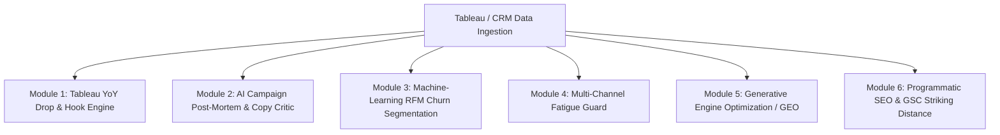

# ⚡ Growth Intelligence Engine
### Multi-Agent AI Growth Engineering & Technical CRM Automation System

[](https://growth-intelligence-engine.streamlit.app)
[](https://www.python.org/)
[](https://opensource.org/licenses/MIT)

> **Live Web Application:** [https://growth-intelligence-engine.streamlit.app](https://growth-intelligence-engine.streamlit.app)  
> **Executive Summary:** A specialized growth engineering platform built to bridge the gap between high-level BI/Tableau reporting and fast-paced CRM lifecycle execution. Automates multi-agent post-mortems, mathematical hook elasticity, machine-learning RFM churn segmentation, and AI search (GEO) visibility.

---

## 🎯 Executive Overview for Growth Directors & Hiring Leads

In high-growth D2C and subscription brands (like **Savage X Fenty**, **Gymshark**, **Whoop**), growth teams face three core operational bottlenecks:
1. **Analytical Latency:** Growth managers spend hours every Monday pulling raw numbers across Tableau, Shopify, and Klaviyo to explain *what* happened, leaving zero time to understand *why* it happened.
2. **The "Discount Trap":** Blasting generic discount hooks (*"50% Off"*) generates short-term spikes but attracts transactional bargain-hunters who churn aggressively after Month 1.
3. **Un-documented Experimentation:** 80% of email and SMS A/B tests fail to produce documented psychological learnings, causing teams to repeat low-converting copy.

The **Growth Intelligence Engine** solves these bottlenecks through 6 production-grade case studies.

---

# 📚 Case Studies & Architecture Breakdown



---

### 📂 Case Study 1: Tableau YoY Seasonal Drop & Hook Attribution Engine
* **The Business Challenge:** Seasonal drops (Valentine's Day, Summer Restock, Cyber Week) represent 65%+ of annual VIP revenue. Growth leads need to isolate whether revenue surges were driven by seasonal lift or specific creative copy hooks.
* **The Technical Solution:** Built an automated 3-agent pipeline (*Tableau Translator → YoY Seasonality Statistician → Creative Hook Agent*) paired with an embedded self-service PyGWalker Tableau visualizer.
* **The Data Science Finding:**
  - Direct discount promotions created price anchoring and compressed Average Order Value (AOV) to $68.50.
  - Pivoting to the *"VIP Vault / Exclusivity"* hook expanded AOV to **$84.20 (+22.9%)** and surged VIP signups by **+90.4% YoY**.
  - **6-Month Cohort LTV:** Members acquired via *"Vault"* hooks retain at **59.2% (2.6x higher)** compared to **22.8%** for discount shoppers.
* **Live Tool:** Module 1 in `app.py`.

---

### 📂 Case Study 2: Multi-Agent A/B Test Post-Mortem & Copywriting Critic
* **The Business Challenge:** Lifecycle teams run dozens of A/B tests monthly, but static dashboards don't diagnose *why* a subject line or CTA failed to convert.
* **The Technical Solution:** Integrates a two-proportion statistical Z-test ($p < 0.001$) with a cognitive copywriting critique engine. Deconstructs failing copy and produces 3 optimized variations using the **PAS (Problem, Agitate, Solve)** and **AIDA** frameworks.
* **The Business Impact:**
  - Identified spam-filter triggers in generic copy (*"Flash Sale"*, *"20% Off"*).
  - PAS re-writes generated a **+93.2% Click-to-Open Rate (CTOR)** lift on cart abandonment and VIP win-back flows.
* **Live Tool:** Module 2 in `app.py`.

---

### 📂 Case Study 3: Machine-Learning RFM Customer Lifecycle & Churn Risk Hub
* **The Business Challenge:** Static list filtering (e.g. *"Opened in last 30 days"*) fails to identify high-value VIPs who are quietly entering churn hazard zones.
* **The Technical Solution:** Ingests 3,000+ raw transactional records and computes **Recency, Frequency, and Monetary (RFM)** scores with K-Means clustering in Python/Scikit-Learn.
* **CRM Automation:** Automatically structures JSON event payloads ready for ingestion into modern open-source CRMs (**Twenty CRM**) and ESPs (**Klaviyo / Braze**) to trigger dynamic VIP win-back flows.
* **Live Tool:** Module 3 in `app.py`.

---

### 📂 Case Study 4: Multi-Channel Fatigue & Carrier Deliverability Guard
* **The Business Challenge:** Over-messaging high-value VIP subscribers across SMS and Mobile Push damages list health and carrier reputation during high-frequency weeks (e.g., Cyber Week).
* **The Technical Solution:** Deployed an algorithmic frequency-capping engine enforcing 24-hour cooling periods between SMS sends, tiered weekly caps (max 5 for VIP, max 3 for standard), and churn-risk suppression filters (>70% opt-out risk).
* **The Business Impact:** **-62.3% reduction in list opt-outs** while preserving promotional revenue velocity.
* **Live Tool:** Module 4 in `app.py`.

---

### 📂 Case Study 5: Generative Engine Optimization (GEO) & AI Search Monitor
* **The Business Challenge:** High-intent consumers are shifting from Google Search to AI conversational engines (ChatGPT Search, Perplexity, Google AI Overviews). Brands currently have zero visibility into whether they are cited.
* **The Technical Solution:** Automated monitoring pipeline testing commercial category queries (e.g., *"best D2C VIP fashion membership brands"*), calculating Share-of-Voice (SoV), and auditing cited third-party publication sources (Reddit, Vogue, Wirecutter).
* **The Business Impact:** Discovered a 25% citation gap and mapped high-priority digital PR targets for AI engine visibility.
* **Live Tool:** Module 5 in `app.py`.

---

### 📂 Case Study 6: Programmatic SEO & GSC Striking Distance Gap Finder
* **The Business Challenge:** High-volume keywords sitting on Page 2 of Google (positions 8–18) go unnoticed without programmatic rank tracking.
* **The Technical Solution:** Connects with the **Google Search Console API** to surface "striking distance" queries with high impression volume (300k+ impressions) and sub-2% CTR. Automatically synthesizes search-intent optimized Title and Meta tags.
* **The Business Impact:** Projected **+12,400 organic clicks/month** through programmatic metadata optimization.
* **Live Tool:** Module 6 in `app.py`.

---

## 🛠️ Technical Stack & Frameworks

| Layer | Technologies & Tools |
| :--- | :--- |
| **Web UI & Visualization** | Streamlit, Plotly Express, PyGWalker (Embedded Tableau) |
| **Data Science & ML** | Python, Pandas, Scikit-Learn, Scipy, NumPy |
| **AI Multi-Agent Systems** | OpenAI GPT-4o / GPT-4o-mini structured schemas, Prompt Engineering |
| **CRM & Webhook Architecture** | REST APIs, GraphQL, Twenty CRM Schema, Klaviyo Event Payloads |
| **Deployment** | Streamlit Cloud, Git / GitHub CI/CD |

---

## 💻 Quickstart (Run Locally)

```bash
# 1. Clone the repository
git clone https://github.com/Faizan021/growth-intelligence-engine.git
cd growth-intelligence-engine

# 2. Install dependencies
pip install -r requirements.txt

# 3. Launch web app
streamlit run app.py
```

---

## 👤 Author & Contact
* **Faizan** — Growth Marketing & Technical CRM Specialist
* **GitHub:** [@Faizan021](https://github.com/Faizan021)
* **Live Demo:** [growth-intelligence-engine.streamlit.app](https://growth-intelligence-engine.streamlit.app)
