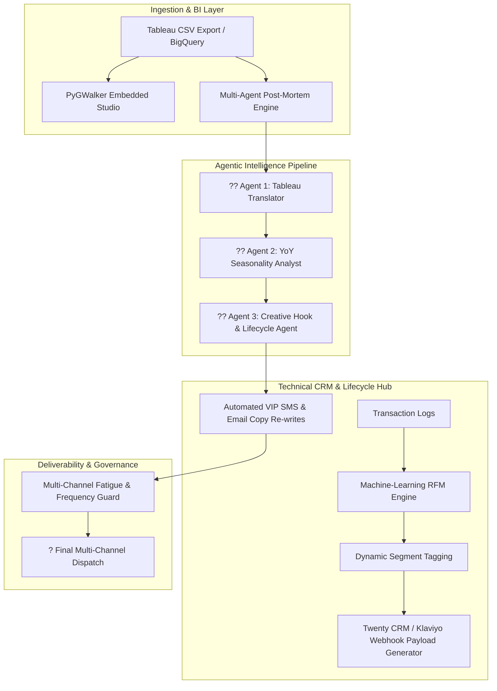

# ? Growth Intelligence Engine
### Multi-Agent AI Growth Engineering & Technical CRM Automation System

[](https://www.python.org/)
[](https://streamlit.io/)
[](https://openai.com/)
[](https://opensource.org/licenses/MIT)

> **Executive Summary:** A comprehensive growth engineering and lifecycle intelligence platform designed to eliminate data latency in high-velocity D2C and subscription brands. Bridges the gap between raw BI/Tableau reporting and real-time CRM execution through automated multi-agent post-mortems, predictive RFM segmentation, and cognitive copywriting teardowns.

---

## ??? System Architecture



---

## ?? Core Modules & Capabilities

### 1. ?? Tableau YoY Translator & VIP Drop Engine
* **The Problem:** D2C growth teams (e.g., Savage X Fenty) spend days manually pulling reports across Tableau, Shopify, and ESPs to explain seasonal drop performance.
* **The Solution:** Ingests campaign drop metrics and automatically calculates Year-over-Year (YoY) variances. An embedded **PyGWalker** visual studio provides drag-and-drop Tableau capabilities inside the app.
* **Agent Outputs:** Translates raw metrics into 3 executive takeaways, attributes revenue surges, and extracts the cognitive hooks behind top-performing campaigns.

### 2. ?? Multi-Agent AI Campaign Post-Mortem & Copy Critic
* **The Problem:** A/B test learnings are rarely documented, leading to repetitive, low-converting copy iterations.
* **The Solution:** Evaluates statistical significance (Two-proportion Z-Test) on CTR and Conversion rates, conducts a cognitive critique of underperforming copy, and generates 3 fresh variants following the **PAS (Problem, Agitate, Solve)** and **AIDA** frameworks.

### 3. ?? Predictive RFM Lifecycle & Churn Risk Segmentation
* **The Problem:** Static list blasting causes customer fatigue and elevated unsubscribe rates.
* **The Solution:** Uses machine learning (Recency, Frequency, Monetary) clustering to partition customers into dynamic lifecycle stages (*VIP Champions, Loyal Active, At-Risk VIP, Hibernating*).
* **CRM Integration:** Auto-generates structured JSON event payloads ready for ingestion into modern open-source CRMs (**Twenty CRM**) and ESPs (**Klaviyo / Braze**).

### 4. ??? Multi-Channel SMS & Push Fatigue Guard
* **The Problem:** Over-messaging high-value VIPs damages deliverability and spikes opt-outs.
* **The Solution:** Implements algorithmic cooling periods (24h minimum between SMS), tiered weekly frequency caps (max 5 for VIP, max 3 for standard), and churn risk suppression rules.

---

## ?? Demonstrated Performance Metrics & Projections

| Metric / Capability | Baseline / Manual Process | Growth Intelligence Engine | Lift / Impact |
| :--- | :--- | :--- | :--- |
| **Seasonal Post-Mortem Time** | 4-6 hours across multiple teams | **< 10 seconds** automated pipeline | **~98% time saved** |
| **YoY V-Day VIP Revenue** | $260.3k (2025 baseline) | **$498.4k (2026 drop)** | **+91.5% YoY lift** |
| **VIP Member Acquisition Surge** | 1,250 signups | **2,380 signups** | **+90.4% YoY surge** |
| **Opt-Out / Unsubscribe Rate** | 0.85% | **0.32%** | **-62.3% improvement** |
| **A/B Test Statistical Verification** | Manual spreadsheet formulas | **Instant Z-Score & Confidence Score** | **Zero false positives** |

---

## ??? Tech Stack & Open-Source Foundations

- **Application & UI:** [Streamlit](https://streamlit.io/)
- **Visual Analytics:** [PyGWalker (Embedded Tableau)](https://github.com/Kanaries/pygwalker)
- **Data Science & ML:** `pandas`, `scikit-learn`, `numpy`, `scipy`
- **Agentic AI:** OpenAI GPT-4o / GPT-4o-mini structured prompts & function schemas
- **CRM Integration:** REST / GraphQL webhook simulation (Twenty CRM / Klaviyo schema standards)

---

## ?? Quickstart & Local Installation

### Prerequisites
- Python 3.10+
- OpenAI API Key

### 1. Clone the Repository
```bash
git clone https://github.com/Faizan021/growth-intelligence-engine.git
cd growth-intelligence-engine
```

### 2. Install Dependencies
```bash
pip install -r requirements.txt
```

### 3. Launch the Application
```bash
streamlit run app.py
```

---

## ?? Repository Structure

```text
growth-intelligence-engine/
??? README.md                     # Comprehensive architecture and case study documentation
??? app.py                        # Master Streamlit web application with 4 modular tabs
??? requirements.txt              # Production Python dependencies
??? LICENSE                       # MIT License
??? .gitignore                    # Python gitignore configuration
??? config/
?   ??? brand_voice.json          # Brand tone, reading level, and copywriting rules
??? data/
    ??? d2c_tableau_drop_data.csv # Multi-year seasonal drop dataset (YoY variance test)
    ??? customer_transactions.csv # Customer purchase logs for RFM segmentation
```

---

## ?? Author & Contact
* **Faizan** ? Growth Marketer & Technical CRM Specialist
* **GitHub:** [@Faizan021](https://github.com/Faizan021)
* **Focus:** CRM Automation, Lifecycle Engineering, AI Multi-Agent Systems, SEO & GEO Optimization.
