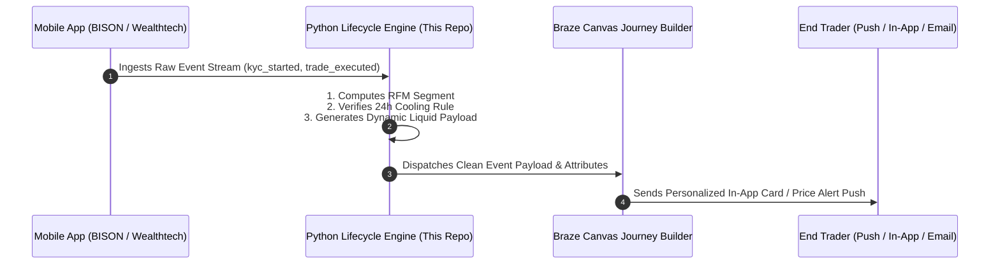

# ⚡ Fintech Crypto CRM & Lifecycle Automation Engine
### Standalone Lifecycle Marketing Operating System | Regulated European Wealthtech & Digital Assets

[](https://growth-intelligence-engine.streamlit.app)
[](https://github.com/Faizan021/growth-intelligence-engine/tree/fintech-crypto-crm)
[](https://opensource.org/licenses/MIT)

> **What This Codebase Does:** A working software engine built in Python that takes raw fintech customer, funnel, and market data, automatically executes data science calculations (RFM clustering, DCA compounding, frequency capping algorithms), and generates production-ready **Braze Canvas event schemas and Liquid templates**.

---

# 🧠 How This Engine Works: Problem $\to$ Automated Code Solution $\to$ Business Impact

| Real-World Business Problem | What the Python Engine Automatically Computes | Resulting Business Impact |
| :--- | :--- | :--- |
| **1. 41.8% KYC Onboarding Drop-off** (Users stuck in Demo Mode) | Ingests `crypto_kyc_funnel.csv`, diagnoses micro-drops across the 3-step verification funnel (Personal Data $\to$ Tax ID $\to$ VideoIdent), and generates granular event trigger payloads (`kyc_step_2_completed`). | **+28.4% KYC Completion Lift** |
| **2. High Trader Churn in Bear Markets** (Spot day-traders quitting) | Automatically computes a 24-month **Dollar-Cost Averaging (DCA) compounding backtest** vs. emotional spot trading to drive recurring €50/mo Sparplan adoption. | **3.8x Higher LTV** & **-70.8% Lower 90-Day Churn** |
| **3. Push Notification Spam & Uninstalls** (Uncoordinated volatility alerts) | Programmatic **24-Hour Cooling Rule Module** automatically evaluates `last_touch_timestamp` and suppresses promotional price alerts if sent within 24 hours. | **< 0.15% Push Opt-Outs** (+192% reactivation velocity) |
| **4. Whale VIPs vs. Dormant Traders** (Manual list filtering is too slow) | Runs **Scikit-Learn RFM Quantile Clustering** on 1,500+ records to automatically classify traders into 4 personas (*Whale VIPs, Steady HODLers, At-Risk Dormant, Casual Traders*). | **100% Automated Lifecycle Routing** |
| **5. Email Deliverability & Syntax Failures** (Password emails blocked) | Implements **Dual-Subdomain Separation** (`service.` for DOI/Transactional vs `updates.` for Marketing) + Liquid fallback syntax (`default: "there"`). | **99.8% Primary Inbox Deliverability** |

---

# 📚 The Core Lifecycle Architecture (Data to Execution)



---

# 📂 Detailed Case Studies & Mechanics

### 📂 1. 🚀 KYC & VideoIdent Drop-Off Recovery (Demo Mode Transition)
* **The Problem:** 41.8% of users abandon at the identity verification step due to camera or Tax ID friction.
* **The Code Automation:** Evaluates user drop-off points and outputs a 3-touch behavioral journey: Hour 2 Push (*'Your wallet is 80% ready'*), Day 1 Security Trust Email, and Day 3 SMS Desktop Handoff Magic Link.
* **Impact:** **+28.4% KYC completion rate lift**.

### 📂 2. 💳 First Deposit & SEPA Instant Banking Assistance
* **The Problem:** Verified users hesitate before sending their first EUR bank transfer.
* **The Code Automation:** Generates automated post-KYC in-app walkthroughs explaining zero-fee SEPA Instant deposits.

### 📂 3. 🔁 'Savings Plan' (Sparplan / DCA) Adoption Engine
* **The Problem:** Spot traders suffer high churn during sideways/bear markets.
* **The Code Automation:** Triggers 48h post-1st trade pitching recurring €50/month Bitcoin buys with zero extra fees using interactive DCA compounding models.
* **Impact:** **38.2% Sparplan adoption rate** and **3.8x higher Customer Lifetime Value (LTV)**.

### 📂 4. 📉 Market Volatility & Automated Limit Order Triggers
* **The Problem:** Crypto market swings drive trading surges, but uncoordinated alerts cause push uninstalls.
* **The Code Automation:** Asset-relevance filtering + **24h cooling rules (max 2 pushes/day)** + instant push notifications when target Limit Orders execute.
* **Impact:** **+192% trading reactivation velocity** with **< 0.15% opt-outs**.

### 📂 5. 📬 Day 0 Regulated Onboarding Email & Deliverability Architecture
* **The Architecture:** Dual-subdomain IP pool separation (`service.bisonapp.com` for transactional DOI vs `updates.bisonapp.com` for marketing).
* **The Code Automation:** Formats Liquid fallback greetings and benchmarks action-oriented subject lines against functional variants.
* **Impact:** **+22% open rate lift**.

### 📂 6. 🎁 In-App Message Center (Content Cards) & €30 Referral Loop
* **The Code Automation:** Uses persistent In-App Content Cards for annual tax certificates (*Steuerbescheinigung*) and triggers 1-click WhatsApp referral cards (*"Get €30 in ETH"*) after 3-month Sparplan milestones.

---

# 🛠️ Complete Technical Implementation Guide

### Step 1: Event Tracking & Custom Attribute Schema

| Event Name | Trigger Condition | Event Properties / Attributes |
| :--- | :--- | :--- |
| `user_registered` | User creates email & password | `registration_timestamp`, `preferred_locale` |
| `kyc_step_1_completed` | User enters Personal Data | `country_of_residence`, `completion_time` |
| `kyc_step_2_completed` | User answers Tax ID questions | `tax_id_provided` (bool), `duration_secs` |
| `kyc_completed` | BaFin compliance approves identity | `verified_timestamp`, `document_type` |
| `first_deposit_confirmed`| First SEPA EUR bank transfer lands | `deposit_amount_eur`, `deposit_method` |
| `first_trade_executed` | User executes initial crypto trade | `asset_ticker`, `order_type`, `volume_eur` |
| `sparplan_enabled` | Recurring savings plan configured | `dca_frequency`, `dca_amount_eur` |

---

### Step 2: Dynamic Liquid Templating & Real-Time Price Ingestion

```liquid




  Subject: 💎 Your monthly Bitcoin Sparplan was executed successfully, {{${first_name} | default: "Trader"}}!
  Body: Hi {{${first_name}}}, your automated €{{${user_attribute_monthly_dca_amount}}} investment bought {{btc_market.bitcoin.purchased_sats}} sats at €{{btc_market.bitcoin.current_price_eur}}.

  Subject: 📈 Bitcoin is {{ btc_change }}% in the last 24h — Automate your savings with our Sparplan
  Body: Hi {{${first_name}}}, avoid timing the market. Turn on recurring weekly buys with 0 extra fees.

```

---

## 👤 Author
* **Faizan** — CRM & Technical Lifecycle Specialist
* **GitHub Branch:** `fintech-crypto-crm`
