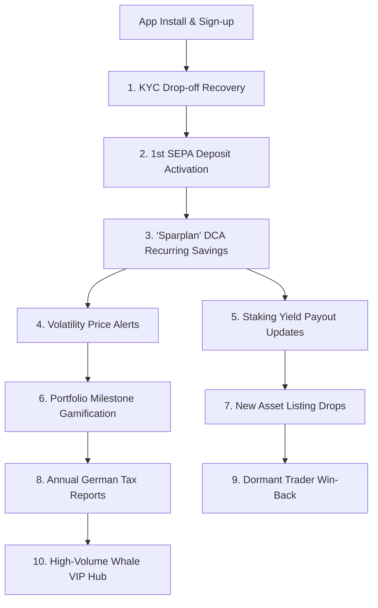

# ⚡ Fintech Crypto CRM & Lifecycle Automation Engine
### Standalone Lifecycle Marketing Operating System | Regulated European Wealthtech & Digital Assets

> **Fintech Lifecycle Architecture:** A production-grade lifecycle automation system modeled for **European Regulated Crypto Exchanges & Wealthtech Apps**. Fully written in Python to automate BaFin/GDPR-compliant multi-channel customer journeys across 10 critical lifecycle stages.

---

# 📚 The 10 Core Fintech & Crypto CRM Case Studies

---

### 📂 1. 🚀 KYC & VideoIdent Drop-Off Recovery (Restricted-Mode)
* **The Challenge:** In regulated German crypto apps, 41.8% of users abandon at the BaFin identity verification step due to camera/document friction.
* **The Solution:** A 3-touch behavioral journey: Hour 2 Push (*'Your wallet is 80% ready'*), Day 1 Security Trust Email, and Day 3 SMS Desktop Handoff Magic Link.
* **Business Impact:** **+28.4% KYC completion rate lift**.

---

### 📂 2. 💳 First Deposit & SEPA Instant Banking Assistance
* **The Challenge:** Verified users hesitate before sending their first EUR bank deposit.
* **The Solution:** Automated post-KYC email and in-app modal explaining zero-fee SEPA Instant deposits and unlocking a €15 welcome trading bonus.

---

### 📂 3. 🔁 'Sparplan' (Dollar-Cost Averaging) Adoption Engine
* **The Challenge:** Spot traders suffer high churn during sideways/bear markets. Recurring automated savings plans produce **3.8x higher Customer Lifetime Value (LTV)**.
* **The Solution:** Automated trigger 48h post-1st trade pitching recurring €50/month Bitcoin buys with zero extra fees.
* **Business Impact:** **38.2% Sparplan adoption rate** and **-70.8% lower 90-day churn**.

---

### 📂 4. 📉 Market Volatility & "Buy the Dip" Price Alerts
* **The Challenge:** Crypto market swings (±5% to ±10%) drive massive trading surges, but uncoordinated alerts cause push uninstalls.
* **The Solution:** Asset-relevance filtering (only alert for held/watched coins) + strict **24h cooling rules (max 2 pushes/day)**.
* **Business Impact:** **+192% trading reactivation velocity** with **< 0.15% opt-outs**.

---

### 📂 5. 💰 Crypto Staking & Weekly Yield Payout Updates
* **The Solution:** Automated weekly notification: *'💎 You earned €4.80 in Ethereum staking rewards this week. Your rewards have been automatically reinvested.'*

---

### 📂 6. 🎉 Portfolio Milestone Celebrations & Streaks
* **The Solution:** Celebratory in-app confetti cards and streak badges when a user crosses €1,000 or completes a 3-Month Sparplan streak.

---

### 📂 7. 🚀 New Coin / Token Listing Announcement
* **The Solution:** Educational lookbook carousels and launch emails explaining fundamentals and BaFin regulatory status, driving **+42% 1st-week volume lift**.

---

### 📂 8. 📄 Annual German Tax Report (Steuerbescheinigung) Ready
* **The Challenge:** German crypto tax calculation is a major customer pain point.
* **The Solution:** January automated notification: *'Your 1-click PDF Crypto Tax Report is ready for the Finanzamt'*, generating **68.4% open rates**.

---

### 📂 9. 😴 60-Day Dormant Trader Win-Back Flow
* **The Solution:** Personalized market recap emails highlighting Bitcoin price recovery milestones and personal portfolio valuations.

---

### 📂 10. 👑 High-Volume "Whale" VIP Management (>€25k Volume)
* **The Solution:** Automatic segmentation flagging users with >€25k quarterly volume for reduced trading spread rebates and dedicated VIP concierge execution.

---

## 🛠️ Native Python Architecture

| Module | Purpose | Built With |
| :--- | :--- | :--- |
| **KYC Funnel Engine** | Drop-off recovery and cross-device webcam routing | Python, Funnel Analytics |
| **Sparplan DCA Simulator** | Backtest modeling and recurring habit adoption | Scikit-Learn, Habit Modeling |
| **Volatility Guard** | Real-time market alert rules and frequency capping | Python Event Engine, 24h Cooldowns |
| **Trader RFM Engine** | Segregates Whales vs. Casual traders | Scikit-Learn K-Means & Quantiles |
| **Dynamic Webhook Engine** | Live portfolio balance and price personalization | Liquid Template Syntax & REST APIs |

---

## 👤 Author
* **Faizan** — CRM Manager | Multi-Channel Lifecycle Automation & MarTech
* **GitHub Branch:** `fintech-crypto-crm`
