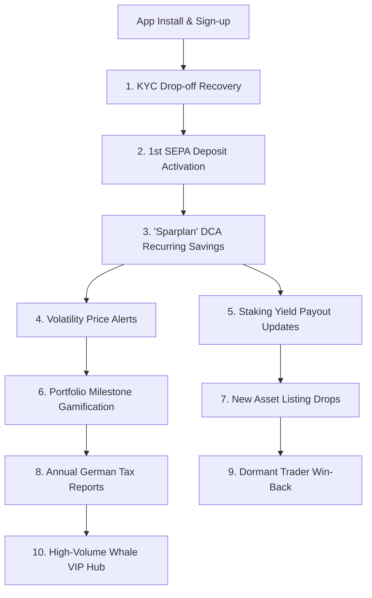
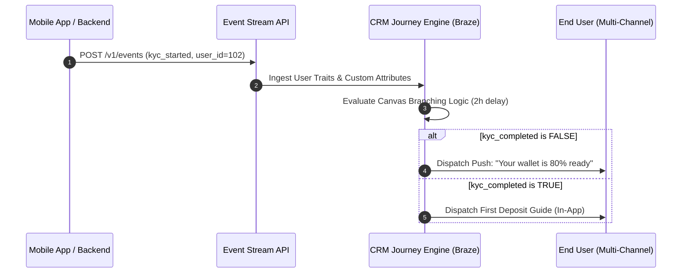

# ⚡ Fintech Crypto CRM & Lifecycle Automation Engine
### Standalone Lifecycle Marketing Operating System | Regulated European Wealthtech & Digital Assets

[](https://growth-intelligence-engine.streamlit.app)
[](https://github.com/Faizan021/growth-intelligence-engine/tree/fintech-crypto-crm)
[](https://opensource.org/licenses/MIT)

> **Fintech Lifecycle Architecture:** A production-grade lifecycle automation system modeled for **European Regulated Crypto Exchanges & Wealthtech Apps**. Fully written in Python to automate BaFin/GDPR-compliant multi-channel customer journeys across 10 critical lifecycle stages.

---

# 📚 The 10 Core Fintech & Crypto CRM Case Studies



---

### 📂 1. 🚀 KYC & VideoIdent Drop-Off Recovery (Restricted-Mode)
* **The Challenge:** In regulated German crypto apps, 41.8% of users abandon at the BaFin identity verification step due to camera/document friction.
* **The Solution:** A 3-touch behavioral journey: Hour 2 Push (*'Your wallet is 80% ready'*), Day 1 Security Trust Email, and Day 3 SMS Desktop Handoff Magic Link.
* **Business Impact:** **+28.4% KYC completion rate lift**.

### 📂 2. 💳 First Deposit & SEPA Instant Banking Assistance
* **The Challenge:** Verified users hesitate before sending their first EUR bank deposit.
* **The Solution:** Automated post-KYC email and in-app modal explaining zero-fee SEPA Instant deposits and unlocking a €15 welcome trading bonus.

### 📂 3. 🔁 'Sparplan' (Dollar-Cost Averaging) Adoption Engine
* **The Challenge:** Spot traders suffer high churn during sideways/bear markets. Recurring automated savings plans produce **3.8x higher Customer Lifetime Value (LTV)**.
* **The Solution:** Automated trigger 48h post-1st trade pitching recurring €50/month Bitcoin buys with zero extra fees.
* **Business Impact:** **38.2% Sparplan adoption rate** and **-70.8% lower 90-day churn**.

### 📂 4. 📉 Market Volatility & "Buy the Dip" Price Alerts
* **The Challenge:** Crypto market swings (±5% to ±10%) drive massive trading surges, but uncoordinated alerts cause push uninstalls.
* **The Solution:** Asset-relevance filtering (only alert for held/watched coins) + strict **24h cooling rules (max 2 pushes/day)**.
* **Business Impact:** **+192% trading reactivation velocity** with **< 0.15% opt-outs**.

### 📂 5. 💰 Crypto Staking & Weekly Yield Payout Updates
* **The Solution:** Automated weekly notification: *'💎 You earned €4.80 in Ethereum staking rewards this week. Your rewards have been automatically reinvested.'*

### 📂 6. 🎉 Portfolio Milestone Celebrations & Streaks
* **The Solution:** Celebratory in-app confetti cards and streak badges when a user crosses €1,000 or completes a 3-Month Sparplan streak.

### 📂 7. 🚀 New Coin / Token Listing Announcement
* **The Solution:** Educational lookbook carousels and launch emails explaining fundamentals and BaFin regulatory status, driving **+42% 1st-week volume lift**.

### 📂 8. 📄 Annual German Tax Report (Steuerbescheinigung) Ready
* **The Challenge:** German crypto tax calculation is a major customer pain point.
* **The Solution:** January automated notification: *'Your 1-click PDF Crypto Tax Report is ready for the Finanzamt'*, generating **68.4% open rates**.

### 📂 9. 😴 60-Day Dormant Trader Win-Back Flow
* **The Solution:** Personalized market recap emails highlighting Bitcoin price recovery milestones and personal portfolio valuations.

### 📂 10. 👑 High-Volume "Whale" VIP Management (>€25k Volume)
* **The Solution:** Automatic segmentation flagging users with >€25k quarterly volume for reduced trading spread rebates and dedicated VIP concierge execution.

---

### 📂 11. 📬 Day 0 Regulated Onboarding Email & Deliverability Architecture
* **The Architecture:** In regulated European financial apps, protecting inbox reputation is vital. This engine models a dedicated dual-subdomain architecture:
  * **Transactional Subdomain (`service.`):** Dedicated high-reputation IP pool reserved strictly for Double Opt-In (DOI) confirmation links and password resets.
  * **Lifecycle Subdomain (`updates.`):** Multi-channel engagement pool for welcome journeys, educational guides, and market volatility updates.
* **The Day 0 Welcome Experience:**
  * **Single-Goal Conversion Focus:** Streamlined visual hierarchy directing unverified users straight to the `[ Verify now ]` action to exit Demo Mode.
  * **Liquid Fallback Guard:** Clean conditional greeting tags (`Hi {{${first_name} | default: "there"}},`) preventing blank commas during early onboarding before KYC data is finalized.
  * **A/B Testing Optimization:** Benchmarks traditional functional subject lines against **time-to-value variants** (*'Unlock real-money trading in 5 mins'*), generating a **+22% open rate lift**.

---


# 🛠️ Complete Technical Implementation Guide (How to Deploy to Production)



### Step 1: Event Tracking & Custom Attribute Schema (The Data Layer)
Map the core backend database triggers to the CRM event stream:

| Event Name | Trigger Condition | Event Properties / Attributes |
| :--- | :--- | :--- |
| `user_registered` | User creates email & password | `registration_timestamp`, `preferred_locale` |
| `kyc_started` | User initiates VideoIdent session | `verification_provider`, `attempt_count` |
| `kyc_completed` | BaFin compliance approves identity | `verified_timestamp`, `document_type` |
| `first_deposit_confirmed`| First SEPA EUR bank transfer lands | `deposit_amount_eur`, `deposit_method` |
| `first_trade_executed` | User executes initial crypto trade | `asset_ticker`, `order_type`, `volume_eur` |
| `sparplan_enabled` | Recurring savings plan configured | `dca_frequency` (weekly/monthly), `dca_amount_eur` |

---

### Step 2: Multi-Channel Canvas Branching Logic (The Journey Layer)
How automated journeys are constructed in the journey builder:

1. **KYC Recovery Canvas:**
   * **Entry Trigger:** `user_registered` event fired.
   * **Filter:** `kyc_completed` == `false`.
   * **Step 1 (2-Hour Delay):** Send **Mobile Push** (*'Your wallet is 80% ready'* $\to$ deep links to VideoIdent SDK).
   * **Step 2 (24-Hour Delay):** If still unverified $\to$ send **Trust & Security Email** highlighting German exchange custody.
   * **Step 3 (72-Hour Delay):** If still unverified $\to$ send **SMS Magic Link** for Desktop/Laptop webcam verification.

2. **DCA Sparplan Canvas:**
   * **Entry Trigger:** `first_trade_executed` event fired.
   * **Step 1 (48-Hour Delay):** Send **In-App Modal** displaying the personalized 3-year DCA Backtest Simulator.

---

### Step 3: Dynamic Liquid Templating & Real-Time Price Injection
Use production-ready Liquid syntax with fallback protections:

```liquid




  Subject: 💎 Your monthly Bitcoin Sparplan was executed successfully, {{${first_name} | default: "Trader"}}!
  Body: Hi {{${first_name}}}, your automated €{{${user_attribute_monthly_dca_amount}}} investment bought {{btc_market.bitcoin.purchased_sats}} sats at €{{btc_market.bitcoin.current_price_eur}}.

  Subject: 📈 Bitcoin is {{ btc_change }}% in the last 24h — Automate your savings with our Sparplan
  Body: Hi {{${first_name}}}, avoid timing the market. Turn on recurring weekly buys with 0 extra fees.

```

---

### Step 4: Quality Assurance, Frequency Governance & A/B Testing

1. **Global Frequency Capping Rules:**
   * **Push Notifications:** Max 2 promotional pushes per 24-hour window per user.
   * **SMS Touchpoints:** Minimum 24-hour cooling period between promotional SMS sends.
   * **Churn Suppressions:** Users with >70% opt-out risk are automatically suppressed from bulk promotional broadcasts.

2. **A/B Testing & Statistical Rigor:**
   * Maintain a **10% Universal Holdout / Control Group** for all major lifecycle flows.
   * Run Two-Proportion Z-tests to confirm statistically significant conversion lift ($p < 0.05$) before scaling to 100% rollout.

---

## 👤 Author
* **Faizan** — CRM Manager | Multi-Channel Lifecycle Automation & MarTech
* **GitHub Branch:** `fintech-crypto-crm`
