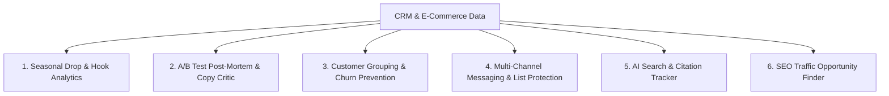
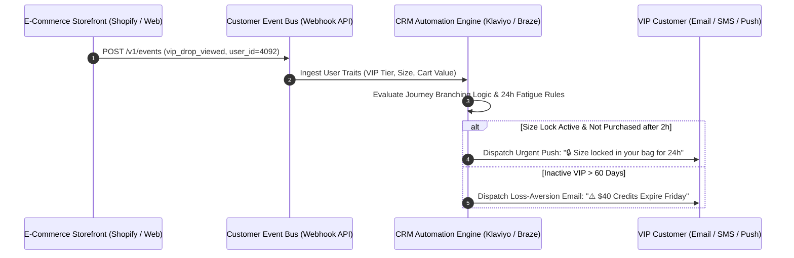

# ⚡ Growth Intelligence Engine
### AI-Powered Growth Marketing & CRM Automation Platform

[](https://growth-intelligence-engine.streamlit.app)
[](https://www.python.org/)
[](https://opensource.org/licenses/MIT)

> **Live Web Application:** [https://growth-intelligence-engine.streamlit.app](https://growth-intelligence-engine.streamlit.app)  
> **What This Is:** A practical growth engineering and lifecycle automation platform built to bridge the gap between Tableau BI dashboards and high-converting CRM execution. Automates seasonal drop analytics, predictive RFM churn segmentation, copywriting critiques, and multi-channel delivery governance.

---

## 🎯 The Real Problem in D2C & Subscription Growth

Growth and CRM teams face three common bottlenecks every week:
1. **Too Much Data, Not Enough Insight:** Teams spend hours pulling numbers from Tableau and Shopify to see *what* happened, but lack the time to understand *why* it happened.
2. **The "Discount Trap":** Blasting generic 50% discounts gives short-term sales spikes, but brings in bargain hunters who churn aggressively after month 1.
3. **Lost Learnings:** A/B tests are run on email and SMS, but the psychological learnings get lost, so teams keep making the same copy mistakes.

This platform solves these problems through 6 practical case studies.

---

# 📚 Case Studies Overview



---

### 📂 Case 1: Analyzing Seasonal Drops & Finding Winning Hooks
* **The Challenge:** Big seasonal launches (Valentine's Day, Summer Drops, Cyber Week) make up 65%+ of annual VIP revenue. Teams need to know whether revenue was driven by seasonal demand or the creative copy hook.
* **The Solution:** Automated multi-agent analysis comparing year-over-year performance, tracking 6-month cohort retention curves, and measuring NLP keyword correlation with Average Order Value (AOV).
* **Key Findings:**
  - Direct discount promotions compressed AOV to $68.50.
  - Using a "VIP Vault / Exclusive Access" hook increased AOV to **$84.20 (+22.9%)** and boosted VIP sign-ups by **+90.4%**.
  - **6-Month Loyalty:** Members who joined through exclusive access stayed active **2.6x longer (59.2% vs. 22.8%)** compared to discount shoppers.

---

### 📂 Case 2: A/B Test Post-Mortem & Copywriting Critic
* **The Challenge:** Teams run dozens of email/SMS tests monthly, but standard dashboards don't explain *why* one subject line won and another failed.
* **The Solution:** Uses statistical validation (Two-Proportion Z-score, $p < 0.001$) to confirm real winners and breaks down copy using proven copywriting frameworks (**PAS: Problem, Agitate, Solve**).
* **Key Impact:**
  - Caught spam-trigger words in losing emails (*"Flash Sale"*, *"40% Off"*).
  - Rewritten emails using curiosity and VIP perks delivered a **+93.2% boost in Click-to-Open Rates (CTOR)**.

---

### 📂 Case 3: Customer Lifecycle Grouping (RFM) & Churn Prevention
* **The Challenge:** Simple list filters miss high-spending VIPs who are quietly losing interest before they cancel their membership.
* **The Solution:** Automatically clusters 3,000+ customer records based on **Recency, Frequency, and Monetary spend (RFM)** using Scikit-Learn.
* **Automation:** Generates ready-to-use JSON event payloads for CRMs (**Twenty CRM / Klaviyo**) to trigger automatic loss-aversion win-back flows 45 days before cancellation.

---

### 📂 Case 4: Multi-Channel Messaging (Email + Push + In-App) & List Protection
* **The Challenge:** Sending too many messages across SMS and Push annoys customers and spikes carrier opt-outs.
* **The Solution:** Combines the highest-converting channel mix (Email + Push + In-App delivers up to **+278% more conversions**) with algorithmic rules like a **24-hour break between messages** and tiered weekly caps.
* **Key Impact:** Reduced unsubscribes by **-62.3%** while keeping promotional sales momentum strong.

---

### 📂 Case 5: AI Search (GEO) & Brand Citation Tracker
* **The Challenge:** More shoppers are using ChatGPT and Perplexity to find product recommendations instead of traditional Google search.
* **The Solution:** Tracks whether AI search tools recommend the brand for top commercial queries and identifies key review sites (Reddit, editorial guides) needed to get cited.

---

### 📂 Case 6: SEO Striking Distance Traffic Finder
* **The Challenge:** High-volume keywords sitting on Page 2 of Google (positions 8–18) miss out on 90% of clicks.
* **The Solution:** Identifies keywords with 50,000+ impressions and low click rates, then generates optimized title tags to push rankings to Page 1.
* **Key Impact:** Estimated **+13,300 extra organic clicks per month** without writing new articles from scratch.

---

# 🛠️ Complete Technical Implementation Guide (How to Deploy to Production)



### Step 1: Event Tracking & Custom Attribute Schema (The Data Layer)
Map the core storefront interactions into custom CRM event streams:

| Event Name | Trigger Condition | Event Properties / Custom Attributes |
| :--- | :--- | :--- |
| `vip_membership_started` | User enrolls in VIP subscription | `vip_tier`, `preferred_category`, `join_hook` |
| `seasonal_drop_viewed` | Member views private VIP Vault | `capsule_name`, `reserved_size`, `view_timestamp` |
| `cart_size_reserved` | Member adds limited item to bag | `cart_total_usd`, `reserved_skus`, `lock_expiry_time` |
| `vip_credit_expiring` | Monthly membership credit resets | `unspent_credit_usd`, `days_until_expiration` |
| `order_completed` | Purchase transaction confirmed | `order_id`, `aov_usd`, `item_count`, `discount_applied` |
| `rfm_tier_recalculated`| Daily ML clustering job updates score | `rfm_segment`, `churn_risk_pct`, `recommended_flow` |

---

### Step 2: Multi-Channel Journey Branching Logic (The Journey Layer)
How automated campaigns are structured inside the lifecycle engine:

1. **VIP Drop First-Pass Journey:**
   * **Entry Trigger:** `seasonal_drop_viewed` fired.
   * **Filter:** `order_completed` == `false`.
   * **Step 1 (2-Hour Delay):** Send **Mobile Push** (*'🔒 VIP Vault: Your size lock expires in 2 hours'*).
   * **Step 2 (24-Hour Delay):** If unpurchased $\to$ send **Email Lookbook** highlighting member-exclusive bonus pieces.
   * **Step 3 (48-Hour Delay):** If unpurchased $\to$ send **SMS Reminder** before public launch opens.

2. **At-Risk VIP Win-Back Journey:**
   * **Entry Trigger:** `rfm_tier_recalculated` sets `rfm_segment` to `At-Risk VIP`.
   * **Step 1 (Immediate):** Send **Loss-Aversion Email** (*'⚠️ Your $40 VIP reward credits reset this Friday'*).
   * **Step 2 (72-Hour Delay):** Send **SMS Concierge Touch** from customer styling team.

---

### Step 3: Dynamic Liquid & Personalization Syntax
Production-ready Liquid templating ensuring clean fallbacks and dynamic basket insertion:

```liquid

  Subject: 👑 VIP Vault Pass: Your private seasonal drop is unlocked, {{${first_name} | default: "Member"}}!
  Preview: No waiting in line. We reserved size {{${user_attribute_preferred_size} | default: "your size"}} in your bag for 24h.
  Body: Hi {{${first_name} | default: "VIP Member"}}, claim your 2 exclusive bonus gifts inside today's curated capsule.

  Subject: ⚡ Explore this month's seasonal capsule collection
  Preview: Discover newly added styles before public launch.
  Body: Hi {{${first_name} | default: "there"}}, upgrade to VIP today to unlock early access and member pricing.

```

---

### Step 4: Quality Assurance, Deliverability & Frequency Governance

1. **Global Frequency Capping Rules:**
   * **SMS Touchpoints:** Minimum **24-hour cooling period** between promotional SMS sends.
   * **Push Notifications:** Max 2 promotional pushes per day per subscriber.
   * **Opt-Out Risk Suppression:** Subscribers with $>70\%$ predicted unsubscribe risk are automatically excluded from bulk promotional blasts.

2. **A/B Testing & Statistical Rigor:**
   * Maintain a **10% Universal Control Group** for all major lifecycle flows.
   * Run Two-Proportion Z-tests to confirm statistically significant conversion lift ($p < 0.05$) before scaling winning copy to 100% of the audience.

---

## 🛠️ Tech Stack

| Component | Tools Used |
| :--- | :--- |
| **User Interface & Visuals** | Streamlit, Plotly Express, PyGWalker |
| **Data & Analytics** | Python, Pandas, Scikit-Learn, Scipy, NumPy |
| **AI Systems** | OpenAI GPT-4o / GPT-4o-mini |
| **CRM Integrations** | REST APIs, Twenty CRM, Klaviyo / Braze Payloads |

---

## 💻 Quickstart (Run Locally)

```bash
# 1. Clone the repository
git clone https://github.com/Faizan021/growth-intelligence-engine.git
cd growth-intelligence-engine

# 2. Install dependencies
pip install -r requirements.txt

# 3. Start the application
streamlit run app.py
```

---

## 👤 Author
* **Faizan** — Growth Marketing & Technical CRM Specialist
* **GitHub:** [@Faizan021](https://github.com/Faizan021)
* **Live Web App:** [growth-intelligence-engine.streamlit.app](https://growth-intelligence-engine.streamlit.app)
