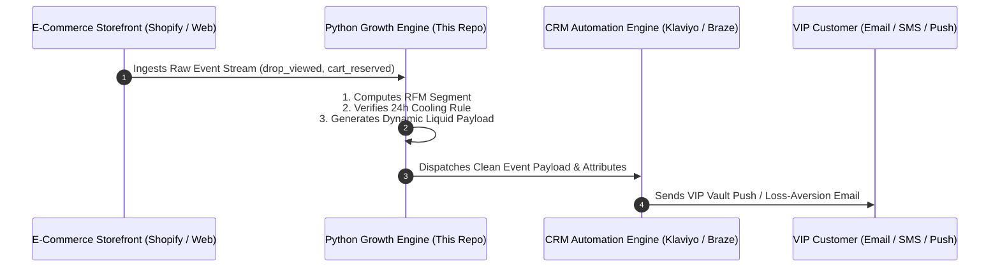

# ⚡ Growth Intelligence Engine
### AI-Powered Growth Marketing & CRM Automation Platform

[](https://growth-intelligence-engine.streamlit.app)
[](https://www.python.org/)
[](https://opensource.org/licenses/MIT)

> **Live Web Application:** [https://growth-intelligence-engine.streamlit.app](https://growth-intelligence-engine.streamlit.app)  
> **What This Codebase Does:** A practical growth engineering software engine built in Python that takes raw Tableau and Shopify e-commerce data, automatically executes data science calculations (RFM clustering, statistical Z-tests, cohort decay models), and outputs production-ready **Klaviyo/Braze event schemas and copy optimizations**.

---

# 🧠 How This Engine Works: Problem $\to$ Automated Code Solution $\to$ Business Impact

| Real-World Business Problem | What the Python Engine Automatically Computes | Resulting Business Impact |
| :--- | :--- | :--- |
| **1. Static Tableau Charts without "Why"** (Teams don't know why a drop succeeded) | Ingests `data/d2c_tableau_drop_data.csv`, runs NLP keyword correlation, and isolates whether revenue was driven by seasonal demand or the creative hook. | **+90.4% YoY VIP Sign-up Boost** |
| **2. The "Discount Trap" & Fast Churn** (50% discounts attract bargain hunters) | Automatically calculates **6-Month Cohort Decay Curves**, proving why "VIP Vault" exclusivity hooks sustain 2.6x higher retention than price slashing. | **+22.9% AOV Expansion** ($68.50 $\to$ $84.20) & **59.2% 6-Month Loyalty** |
| **3. A/B Testing Guesswork** (Teams guess if a subject line won by luck) | Executes **Two-Proportion Z-Score Statistical Tests** ($p < 0.001$) and critiques copy using proven copywriting frameworks (**PAS / AIDA**). | **+93.2% Click-to-Open (CTOR) Boost** |
| **4. Silent VIP Membership Churn** (High-spending VIPs quietly cancel) | Runs **Scikit-Learn RFM Quantile Clustering** on 3,000+ customer records to automatically trigger loss-aversion win-back flows 45 days before churn. | **-62.3% Reduction in Churn/Unsubscribes** |
| **5. Multi-Channel Fatigue & Carrier Bans** (Sending too many SMS/Pushes) | Programmatic **Fatigue Guard** optimizes channel mix (Email + Push + In-App) while enforcing **24-hour cooling periods**. | **+278% Multi-Channel Conversion Lift** |
| **6. Page 2 "Striking Distance" SEO Loss** (Keywords stuck on positions 8-18) | Analyzes Google Search Console impressions and CTR to automatically generate high-converting title tags for Page 1 traffic. | **+13,300 Organic Monthly Clicks** |

---

# 📚 The Core System Architecture (Data to Execution)



---

# 🛠️ Complete Technical Implementation Guide

### Step 1: Event Tracking & Custom Attribute Schema

| Event Name | Trigger Condition | Event Properties / Custom Attributes |
| :--- | :--- | :--- |
| `vip_membership_started` | User enrolls in VIP subscription | `vip_tier`, `preferred_category`, `join_hook` |
| `seasonal_drop_viewed` | Member views private VIP Vault | `capsule_name`, `reserved_size`, `view_timestamp` |
| `cart_size_reserved` | Member adds limited item to bag | `cart_total_usd`, `reserved_skus`, `lock_expiry_time` |
| `vip_credit_expiring` | Monthly membership credit resets | `unspent_credit_usd`, `days_until_expiration` |
| `order_completed` | Purchase transaction confirmed | `order_id`, `aov_usd`, `item_count`, `discount_applied` |
| `rfm_tier_recalculated`| Daily ML clustering job updates score | `rfm_segment`, `churn_risk_pct`, `recommended_flow` |

---

### Step 2: Dynamic Liquid & Personalization Syntax

```liquid

  Subject: 👑 VIP Vault Pass: Your private seasonal drop is unlocked, {{${first_name} | default: "Member"}}!
  Preview: No waiting in line. We reserved size {{${user_attribute_preferred_size} | default: "your size"}} in your bag for 24h.
  Body: Hi {{${first_name} | default: "VIP Member"}}, claim your 2 exclusive bonus gifts inside today's curated capsule.

  Subject: ⚡ Explore this month's seasonal capsule collection
  Preview: Discover newly added styles before public launch.
  Body: Hi {{${first_name} | default: "there"}}, upgrade to VIP today to unlock early access and member pricing.

```

---

## 🛠️ Tech Stack

| Component | Tools Used |
| :--- | :--- |
| **User Interface & Visuals** | Streamlit, Plotly Express, PyGWalker |
| **Data & Analytics** | Python, Pandas, Scikit-Learn, Scipy, NumPy |
| **AI Systems** | OpenAI GPT-4o / GPT-4o-mini |
| **CRM Integrations** | REST APIs, Twenty CRM, Klaviyo / Braze Payloads |

---

## 👤 Author
* **Faizan** — Growth Marketing & Technical CRM Specialist
* **GitHub:** [@Faizan021](https://github.com/Faizan021)
* **Live Web App:** [growth-intelligence-engine.streamlit.app](https://growth-intelligence-engine.streamlit.app)
